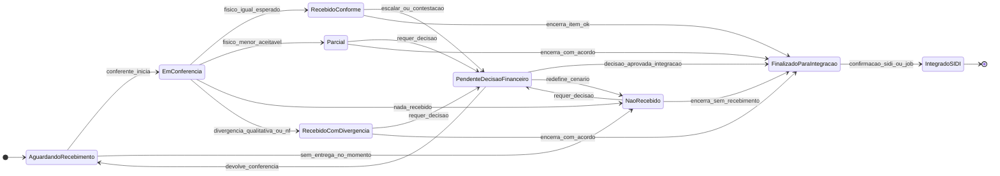

# Máquina de estados — item de conferência (v2)

Documento de apoio à estratégia em `ESTRATEGIA_CONFERENCIA_UNIFICADA.md`.  
Os nomes dos estados coincidem com a seção 7 da estratégia.

---

## 1) Diagrama (visão geral)

Fluxo **único** no modelo de dados; **comprador** e **financeiro** compartilham as mesmas transições. A diferença está nas **validações e campos editáveis** na etapa operacional (ver §2).

**Observação:** no **MVP** pode-se omitir `EmConferencia` e passar direto de `AguardandoRecebimento` aos estados de resultado (`RecebidoConforme`, `Parcial`, etc.), se não houver lock/sessão por item.

---

## 2) O que muda por origem (regra de negócio, não seta extra)

| Aspecto | Compra via **comprador** (app / CEAGESP) | Compra **financeiro direto** |
|--------|------------------------------------------|------------------------------|
| Dados do pedido (fornecedor, produto, unidade, qtd esperada) | Somente leitura na UI; transições **não** alteram esses campos | Podem ser **ajustáveis** com confirmação antes de gravar resultado |
| Foco do conferente | Classificar **recebimento físico** e divergência | Conferência **completa** + maior rigor de validação |
| Divergências | Detalhe suficiente para operação | Incentivar **mais detalhe** (motivos, condições) para decisão financeira |
| Transições no diagrama | **As mesmas** | **As mesmas** — a restrição é de **permissão de edição de campos**, não de estado |

---

## 3) Conjuntos úteis para consultas (API / relatórios)

| Grupo | Estados incluídos | Uso típico |
|-------|-------------------|------------|
| Fila da doca | `AguardandoRecebimento`, opcionalmente `EmConferencia` | Lista principal do conferente |
| Aguardando decisão financeira | `PendenteDecisaoFinanceiro` | Painel financeiro |
| Prontos para integração / e-mail | `FinalizadoParaIntegracao` | Fila contingência SIDI |
| Encerrados no ERP legado / SIDI | `IntegradoSIDI` | Auditoria |

---

## 4) Relação com “pedido concluído”

Definir explicitamente na implementação, por exemplo: o pedido está **pronto para disparo de e-mail / lote** quando **todos** os itens não cancelados estiverem em  
`{ FinalizadoParaIntegracao, IntegradoSIDI }` **ou** política alternativa que inclua `PendenteDecisaoFinanceiro` como bloqueio global — isso é decisão de produto e deve ficar documentada no código (`pedido_esta_concluido` / serviço de domínio).
